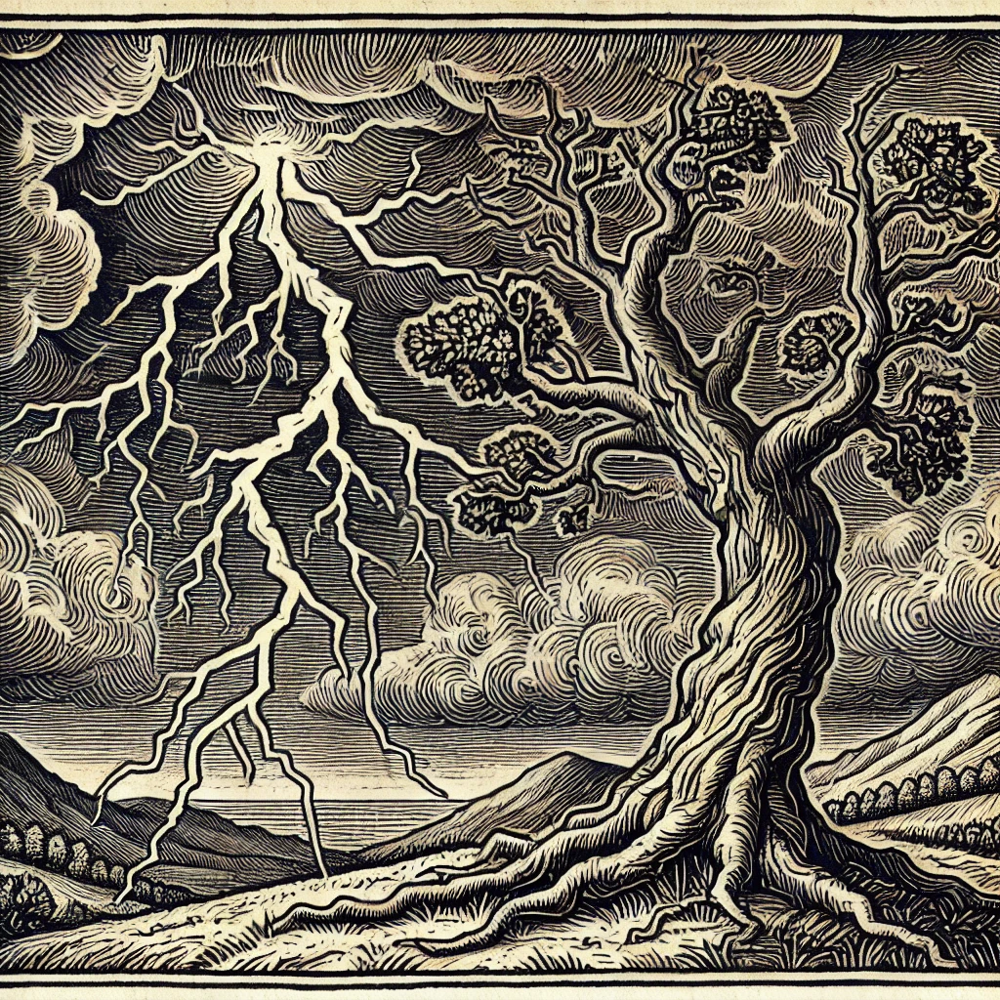

## [Strom](https://janbalanya.com/strom-docs/getting-started)

Intelligent system that controls heating based on weather forecasts and electricity prices. Uses convex optimization to find cost-effective heating schedules while maintaining comfort, automatically controlling smart plugs to save energy costs.

## [DefaultCSS](https://github.com/janbsc4/defaultCSS)

Enables you to quickly get a new web project started without having to worry about CSS. DefaultCSS is CSS file that acts as a starting point for new web projects and includes minimal styling for the most used HTML tags. Responsive design & dark mode included.

## [Hanae](https://github.com/NuriaHB/hanae-y-la-reliquia-del-dragon)

Webpage for a friends art project, built with [Jekyll](https://jekyllrb.com), deployed on Github Pages.